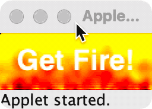

# Fire Applet

I wrote this tiny demo applet one lazy afternoon in 1995 in a SGI Indy Workstation to fool around with its pixel-pushing capabilities, and was amazed to notice that the applet ran at a pretty decent frame rate even on Sun Microsystems JavaStations.

I promptly lost its source code to the sands of time - and found it again almost a decade ago at http://www.1archive.com/java/fire/ - I wrote about it [in my blog](https://javier.rodriguez.org.mx/2015/06/03/fire-java) at the time. 

Lately I cleaned up line breaks and indentation, and as of today (2024) the applet still compiles using JDK 1.8.0_372 with only a few deprecation notices. The compiled class runs under `appletviewer` in the corresponding JRE. The original archive (7KB) and class file (5.8KB!) are included for archaeological purposes, so there's no need to recompile unless you're feeling adventurous.

```shell
javac fire.java
```

I've kept fire.html as-is, but if you were to play with some parameters you would probably want to edit this section:

```html
<applet code="fire.class" width="128" height="48">
    <param name="coolingfactor" value=1>
    <param name="coolingrows" value=60%>
    <param name="coolinglimit" value=80%>
    <param name="text" value="Get Fire!">
    <param name="textfont" value="Helvetica">
    <param name="textsize" value="24">
    <param name="textcolor" value="#FFFFFF">
</applet>
```

If you have a half-decent browser it will probably refuse to show the embedded applet in the fire.html page, so use `appletviewer` instead:

```shell
appletviewer fire.html
```
You should be rewarded with a tiny window running a neat little animation like this:



Today Java is almost 30 years old, but it still brings pain and joy to life - and pays for some bills. Happy Birthday, Java! 
